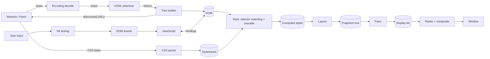
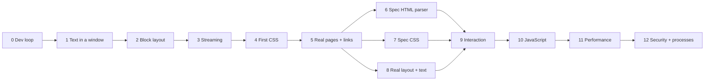

# Rust Browser Architecture and Development Roadmap

This document describes the architecture we are building toward and the order
in which we should build it.

The roadmap is organized for learning. We first build a **thin, naive version
of the whole pipeline** so that something appears on screen early. Then we
repeatedly replace naive pieces with spec-correct, production-style versions.
The page keeps rendering throughout, so every improvement is visible.

Real browsers such as Chromium, Firefox (Gecko/Servo), and WebKit differ in
details, but they share the same core ideas. We follow those ideas while
keeping the codebase small enough to learn from.

## How to use this roadmap

- Work through milestones in order. Within a milestone, do steps in order.
- Each step should fit in roughly one work session and one commit.
- Every step ends with **You'll see**: a new passing test, a debug dump, or a
  visible change in the window. If a step can't show a result, split it or
  add a debug tool that makes the result visible.
- Naive shortcuts are intentional. Each is marked **(naive)** and has a later
  step that replaces it. Keep the shortcuts behind the same interface as the
  real version so the replacement is local.
- Check off steps (`- [x]`) as they land, and update the "Current state"
  table when a milestone is complete.

## Guiding principles

1. **Follow the specifications.** HTML, CSS, DOM, URL, Fetch, and Encoding are
   defined by WHATWG and W3C specs. Name types and steps after the spec where
   practical, and link the relevant section in comments.
2. **Never reject the web.** Browsers recover from malformed input instead of
   failing. Parsers should record parse errors for diagnostics, but still
   produce a document or stylesheet.
3. **Stream and work incrementally.** Parse data as it arrives. Later, restyle,
   re-layout, and repaint only what changed.
4. **Keep stages separate.** Each pipeline stage consumes the previous stage's
   output through a narrow interface. Layout should not parse CSS; paint should
   not inspect the DOM.
5. **Test against shared test suites.** Use html5lib-tests, the CSS parsing
   tests, and Web Platform Tests (WPT) rather than only hand-written examples.
6. **Build what teaches us; reuse what does not.** Implement engine concepts
   ourselves. Use proven crates for specialized infrastructure such as TLS,
   image decoding, font rasterization and shaping, and GPU access.
7. **Design for untrusted content.** Everything from the network is hostile.
   Avoid panics on input, bound resource usage, and plan for process isolation.

## Current state

| Area | Location | Status |
| --- | --- | --- |
| App entry | `src/app` | Fetches `https://example.com`, parses it, prints the DOM. |
| Networking | `src/net` | Blocking `ureq` GET that reads the whole body into a `String`. |
| HTML | `src/html` | Simplified tokenizer and tree builder. Not WHATWG-compliant or streaming. |
| DOM | `src/dom` | Arena of nodes addressed by `NodeId`; supports append only. |
| CSS | `src/css` | Rule-level parser. Selectors and values are kept as raw strings. |

The DOM arena with stable IDs is a good foundation. The existing CSS rule
parser is used in Milestone 4 and rebuilt on a tokenizer in Milestone 7.

## Target architecture

This is the end state. The milestones build toward it one stage at a time.

### Rendering pipeline



| Stage | Input | Output | Notes |
| --- | --- | --- | --- |
| Fetch | URL, request | Response bytes and metadata | Handles redirects, headers, and eventually caching and cookies. |
| Decode | Bytes and charset | Unicode text | Uses the Encoding spec's sniffing rules. |
| HTML parse | Text chunks | DOM mutations | Uses a resumable tokenizer and insertion modes. |
| CSS parse | Text | Stylesheet object model | Tokenizes, then parses rules, selectors, and values. |
| Style | DOM and stylesheets | Computed value per element | Handles specificity, origin, inheritance, and initial values. |
| Box generation | DOM and styles | Box tree | Applies `display`, generates anonymous boxes, and skips `display: none`. |
| Layout | Box tree and viewport | Fragment tree | Computes positioned rectangles, line boxes, and glyph runs. |
| Paint | Fragment tree | Display list | Creates drawing commands in paint order and stacking contexts. |
| Raster/composite | Display list | Pixels | Starts in software; later uses GPU layers. |

### Target module layout

Add modules when a milestone first needs them. Split into a Cargo workspace
when compile times or dependency boundaries justify it.

```text
src/
  app/        window, event loop, browser UI shell (tabs, URL bar)
  engine/     navigation, per-document "frame" that owns the pipeline
  net/        fetch, HTTP, redirects, cache, cookies
  html/       tokenizer/  tree_builder/  (streaming, spec-based)
  dom/        nodes, document, mutation API, events
  css/        tokenizer/  parser/  selectors/  values/
  style/      matching, cascade, computed values, invalidation
  layout/     box tree, block, inline, text, flex, grid
  text/       font loading, shaping, line breaking
  paint/      display list and stacking contexts
  gfx/        rasterization and compositing
  script/     JS engine integration, DOM bindings, event loop
  devtools/   DOM, style, layout, and display-list dumps
```

### Key data-model decisions

- **The DOM is an arena, not `Rc<RefCell<...>>`.** Keep `NodeId` indexes. This
  avoids reference cycles and supports style caches and layout side tables
  keyed by `NodeId`. Node removal will require tombstones or
  generation-checked IDs so old IDs cannot refer to reused slots.
- **Layout does not mutate the DOM.** Styles, boxes, and fragments are
  separate trees or side tables that can be rebuilt. This keeps incremental
  invalidation manageable.
- **Paint produces a display list, not pixels.** Layout and paint never call
  the rasterizer directly. This lets us swap software rendering for GPU
  rendering later and makes paint output testable.
- **Strings will need interning.** Tag names, attribute names, and CSS
  identifiers repeat constantly. Introduce an atom type (similar to Servo's
  `string_cache`) before selector matching becomes expensive.
- **Parsers own resumable state.** HTML and CSS tokenizers should become state
  machines driven by `feed(chunk)` and `finish()`.

## Milestones

Milestones 1–5 build the thin end-to-end browser. Milestones 6–8 make each
stage correct against the specs. Milestones 9–12 add interactivity, scripting,
performance, and security.



Milestones 6, 7, and 8 are independent and can be interleaved.

### Milestone 0: A fast development loop

**Goal:** Make it easy to load any page and inspect each pipeline stage.

- [x] **0.1 Take the URL from the command line.** `cargo run -- <url>`, with
  `https://example.com` as the default.
  *You'll see:* the DOM dump for any site you choose.
- [x] **0.2 Load local files.** Accept a file path or `file://` URL, and add
  `tests/pages/` with small hand-written HTML pages.
  *You'll see:* your own test pages parsed without network access.
- [x] **0.3 Pretty-print the DOM as an indented tree.** Add a `devtools`
  module with `dump_dom`, and a `--dump=dom` flag, instead of `{:#?}`.
  *You'll see:* a readable tree such as `<body>` → `<p>` → `"Hello"`.
- [x] **0.4 Add snapshot tests.** Compare `dump_dom` output for test pages with
  committed `.expected` files, for example using the `insta` crate.
  *You'll see:* parser changes show up as readable diffs.

### Milestone 1: Text in a window

**Goal:** See the page's words in a real window as early as possible.

- [x] **1.1 Open a window.** Use `winit` for the window and `softbuffer` for a
  CPU framebuffer. Fill it with white.
  *You'll see:* an empty browser window that closes cleanly.
- [x] **1.2 Draw one string.** Bundle an open-licensed font (for example Noto
  Sans, under `assets/fonts/`) and rasterize glyphs with `fontdue` or
  `ab_glyph`. **(naive)** No shaping yet; replaced in 8.6.
  *You'll see:* "Hello, browser" rendered in the window.
- [ ] **1.3 Draw the document's text.** Walk the DOM, collect text nodes, and
  skip `head`, `script`, and `style`. Draw them one after another on a single
  line. **(naive)** Replaced by layout in Milestone 2.
  *You'll see:* example.com's words in the window.
- [ ] **1.4 Wrap words.** Split text on whitespace and start a new line when
  the next word would overflow the window width. **(naive)** Replaced by
  inline layout in 8.4.
  *You'll see:* readable paragraphs.
- [ ] **1.5 Re-wrap on resize.** Recompute line positions on window resize.
  *You'll see:* text reflowing as you drag the window edge, which is layout
  reacting to viewport changes.
- [ ] **1.6 Scroll.** Offset drawing by a scroll position controlled by the
  mouse wheel and arrow keys. Draw only lines that are visible.
  *You'll see:* long pages that you can scroll.
- [ ] **1.7 Introduce a display list.** Have text placement produce
  `Vec<DisplayItem>` values such as `Text { x, y, text, size }` and
  `Rect { x, y, w, h, color }`, then have a separate rasterizer draw them.
  *You'll see:* the same output, now with the paint/raster separation real
  browsers use. Add `--dump=display-list`.

### Milestone 2: Boxes and block layout

**Goal:** Turn the DOM into a layout tree and render document structure.

- [ ] **2.1 Build a layout tree.** Create a `layout` module with a box tree
  parallel to the DOM. Classify elements as block or inline using a
  hard-coded list (`div`, `p`, `h1`–`h6`, `ul`, `li`, and so on).
  **(naive)** Replaced by the CSS `display` property in 4.5.
  *You'll see:* `--dump=layout` prints the box tree.
- [ ] **2.2 Stack blocks vertically.** Give each block box `x`, `y`, `width`,
  and `height`. Children stack from top to bottom, and each block's width is
  its parent's width.
  *You'll see:* paragraphs separated into their own lines.
- [ ] **2.3 Add a debug overlay.** Toggle outlines around each box with a key.
  *You'll see:* the box tree drawn over the page, much like browser
  developer tools.
- [ ] **2.4 Size headings and add spacing.** Hard-code larger font sizes for
  `h1`–`h6` and vertical margins for `p` and headings. **(naive)** Replaced by
  the user-agent stylesheet in 4.4.
  *You'll see:* a page hierarchy that looks roughly like a real browser.
- [ ] **2.5 Support inline formatting.** Handle `b`, `strong`, `i`, and `em`
  with bold and italic font faces, and handle `br`.
  *You'll see:* emphasis and manual line breaks.
- [ ] **2.6 Add list markers.** Indent `ul` and `ol`, and draw bullets or
  numbers for `li`.
  *You'll see:* lists rendered as lists.

### Milestone 3: Streaming parsing

**Goal:** Parse HTML while it downloads, as real browsers do.

- [ ] **3.1 Add a resumable parser API.** Introduce
  `HtmlParser::feed(&str)` and `finish() -> Document`, and keep `parse(&str)`
  as a wrapper around them. Buffer incomplete tags between chunks for now.
  *You'll see:* all existing parser tests still pass through the new API.
- [ ] **3.2 Test chunk boundaries.** Assert that splitting input at every
  possible character boundary produces the same DOM.
  *You'll see:* tests catching splits inside tags, attributes, comments, and
  multi-byte characters.
- [ ] **3.3 Stream the network body.** Read the response in chunks, decode
  UTF-8 incrementally without splitting multi-byte characters, and feed each
  chunk to the parser.
  *You'll see:* a `--trace` log of the number of nodes after each chunk.
- [ ] **3.4 Move loading off the UI thread.** Fetch and parse on a worker
  thread and send results to the window through a channel.
  *You'll see:* the window opens and stays responsive while a page loads.
- [ ] **3.5 Render progressively.** Re-run layout and paint on partial DOMs.
  Add a debug option that throttles the network so the effect is visible.
  *You'll see:* a slow page render from top to bottom as it arrives.

### Milestone 4: First CSS

**Goal:** Apply real styles using the existing CSS parser.

- [ ] **4.1 Collect `<style>` text.** Parse each `<style>` element's contents
  with `css::parse` and list the resulting rules.
  *You'll see:* `--dump=stylesheets` prints the page's rules.
- [ ] **4.2 Parse simple selectors.** Parse type, `.class`, `#id`, and
  descendant selectors from rule preludes. Compute specificity.
  *You'll see:* unit tests for selectors and their specificity.
- [ ] **4.3 Match and apply `color` and `background-color`.** Build a
  `style` module that matches rules against elements and parses named and
  hexadecimal colors. Apply the winning value by specificity and source order.
  *You'll see:* the first styled page, with colors taken from its CSS.
- [ ] **4.4 Replace hard-coded styles with a user-agent stylesheet.** Move the
  font sizes, margins, and block/inline list from Milestone 2 into a built-in
  stylesheet based on the HTML spec's rendering section.
  *You'll see:* the same rendering, now driven entirely by CSS.
- [ ] **4.5 Use `display`, `font-size`, `margin`, and `padding`.** Read these
  from computed styles in layout. Support `px`, `em`, and `%` for margins,
  padding, and widths.
  *You'll see:* page CSS changing spacing and layout.
- [ ] **4.6 Add inheritance.** Inherit `color`, `font-size`, and
  `font-family` from parent elements.
  *You'll see:* text inheriting its container's color.
- [ ] **4.7 Draw borders and backgrounds.** Paint `border-width`,
  `border-color`, and `background-color` rectangles.
  *You'll see:* boxes with visible borders and backgrounds.
- [ ] **4.8 Support `style=""` attributes.** Parse inline declarations and
  apply them above stylesheet rules.
  *You'll see:* inline styles overriding stylesheet rules.

### Milestone 5: Real pages and links

**Goal:** Browse between real pages.

- [ ] **5.1 Resolve URLs.** Use the `url` crate to resolve relative URLs
  against the document URL and `<base href>`.
  *You'll see:* unit tests for relative, absolute, and fragment URLs.
- [ ] **5.2 Load external stylesheets.** Fetch `<link rel=stylesheet>` files
  and add them to the cascade in document order.
  *You'll see:* sites with external CSS render with their styles.
- [ ] **5.3 Make links clickable.** Hit-test a click to a layout box, find
  the enclosing `<a href>`, and navigate. **(naive)** Replaced by full hit
  testing and DOM events in Milestone 9.
  *You'll see:* clicking a link loads the next page.
- [ ] **5.4 Add back and forward.** Keep a history stack with keyboard
  shortcuts.
  *You'll see:* navigation back and forth between pages.
- [ ] **5.5 Show the URL in the title bar.** Also show a loading indicator.
  *You'll see:* the current page and loading state.
- [ ] **5.6 Render images.** Fetch `` sources, decode them with the
  `image` crate, and lay them out using their intrinsic size and `width` and
  `height` attributes.
  *You'll see:* images on pages.
- [ ] **5.7 Handle redirects and errors.** Follow redirects and show an error
  page for failed loads.
  *You'll see:* failed loads produce a helpful page instead of a crash.

**Checkpoint:** You now have a small working browser. Milestones 6–8 make its
stages spec-correct one at a time.

### Milestone 6: A spec-correct HTML parser

**Goal:** Parse HTML the way the WHATWG HTML Standard specifies.

- [ ] **6.1 Add the html5lib-tests harness.** Add the suite as a git
  submodule or vendored data. Run it and report pass and fail counts without
  failing CI yet.
  *You'll see:* a baseline pass rate. Each following step should raise it.
- [ ] **6.2 Tokenizer: data, tag, and attribute states.** Replace the
  tokenizer with the spec's state machine, starting with the core states in
  [HTML section 13.2.5]. Keep the `feed` API.
  *You'll see:* tokenizer test pass rate increase.
- [ ] **6.3 Tokenizer: comments and doctypes.** Emit comment and doctype
  tokens, and add comment and doctype nodes to the DOM.
  *You'll see:* comments and doctypes in `--dump=dom`.
- [ ] **6.4 Tokenizer: character references.** Decode named and numeric
  character references using the spec's entity table.
  *You'll see:* `&amp;`, `&copy;`, and `&#8212;` render correctly.
- [ ] **6.5 Tokenizer: RCDATA and raw text.** Handle `title`, `textarea`,
  `style`, and `script`, with the tree builder switching tokenizer states.
  *You'll see:* `<style>` contents containing `<` no longer break parsing.
- [ ] **6.6 Make parse errors non-fatal.** Record errors as diagnostics with
  source positions and always produce a document.
  *You'll see:* `--dump=parse-errors` lists problems while pages still render.
- [ ] **6.7 Tree builder: implied `html`, `head`, and `body`.** Implement the
  `initial`, `before html`, `before head`, `in head`, `after head`, and
  `in body` insertion modes, and record document mode (quirks or no-quirks).
  *You'll see:* bare text such as `Hello` produces a full document structure.
- [ ] **6.8 Tree builder: implied end tags.** Automatically close elements
  such as `p` and `li` when the spec requires it.
  *You'll see:* `<p>a<p>b` produces sibling paragraphs.
- [ ] **6.9 Tree builder: active formatting elements.** Implement the list of
  active formatting elements and the adoption agency algorithm.
  *You'll see:* misnested markup such as `<b><i></b></i>` matches browsers.
- [ ] **6.10 Tree builder: tables.** Implement table insertion modes and
  foster parenting.
  *You'll see:* stray content in tables is moved where browsers place it.
- [ ] **6.11 Tree builder: SVG and MathML.** Add namespaces and foreign
  content rules.
  *You'll see:* inline SVG elements have the correct namespace in the DOM.
- [ ] **6.12 Detect encodings.** Use `encoding_rs` with the BOM,
  `Content-Type` charset, and `<meta charset>` prescan.
  *You'll see:* non-UTF-8 pages display correctly.
- [ ] **6.13 Fuzz the parser.** Add a `cargo fuzz` target.
  *You'll see:* fuzzing runs without panics.

**Exit criteria:** At least 90% of html5lib tree-construction tests pass, and
CI prevents regressions.

### Milestone 7: Spec-correct CSS

**Goal:** Parse and cascade CSS as the CSS specifications define.

- [ ] **7.1 Add a CSS tokenizer.** Implement CSS Syntax Level 3 tokens:
  identifiers, functions, hashes, strings, numbers, dimensions, and
  percentages.
  *You'll see:* `--dump=css-tokens` and passing css-parsing-tests token cases.
- [ ] **7.2 Rebuild the rule parser on tokens.** Keep the current AST, and use
  spec error recovery so an invalid declaration or rule drops only itself.
  *You'll see:* broken CSS no longer discards the rest of the stylesheet.
- [ ] **7.3 Complete selectors.** Add attribute selectors, child and sibling
  combinators, and pseudo-classes such as `:first-child` and `:not()`.
  *You'll see:* selector tests for each new form.
- [ ] **7.4 Implement the full cascade.** Handle origins, `!important`,
  `inherit`, `initial`, and `unset`.
  *You'll see:* `!important` and explicit keywords behaving as in browsers.
- [ ] **7.5 Parse typed values and shorthands.** Represent lengths, colors,
  keywords, and percentages as types, and expand shorthands such as `margin`,
  `border`, `font`, and `background`.
  *You'll see:* `--dump=style` shows typed computed values per element.
- [ ] **7.6 Speed up matching.** Match selectors right to left, add a rule hash
  keyed by ID, class, and tag, and add an ancestor Bloom filter.
  *You'll see:* a benchmark showing style time drop on a large page.
- [ ] **7.7 Add media queries.** Support `@media` width queries.
  *You'll see:* responsive sites changing layout as the window resizes.
- [ ] **7.8 Add custom properties.** Support `--name` declarations and
  `var()`.
  *You'll see:* sites using CSS variables render their themes.

### Milestone 8: Real layout and text

**Goal:** Replace naive layout with the CSS visual formatting model.

- [ ] **8.1 Generate anonymous boxes.** Wrap inline content that sits next to
  blocks in anonymous block boxes.
  *You'll see:* mixed block and inline content matches browsers in the
  debug overlay.
- [ ] **8.2 Compute widths and auto margins.** Implement the CSS 2 width
  equations, including `margin: auto` centering.
  *You'll see:* centered page containers.
- [ ] **8.3 Collapse margins.** Implement vertical margin collapsing.
  *You'll see:* spacing between paragraphs matches browsers.
- [ ] **8.4 Implement inline layout.** Build line boxes with baselines,
  `line-height`, `vertical-align: baseline`, and `text-align`, and split inline
  boxes across lines.
  *You'll see:* mixed font sizes on one line align on a common baseline.
- [ ] **8.5 Break lines correctly.** Use Unicode line breaking (UAX #14) with
  `unicode-linebreak` and support `white-space`.
  *You'll see:* URLs, CJK text, and `<pre>` wrap correctly.
- [ ] **8.6 Shape text.** Use `rustybuzz` or `swash` for shaping, discover
  system fonts with `fontdb`, and add font fallback.
  *You'll see:* ligatures, kerning, and non-Latin scripts render correctly.
- [ ] **8.7 Load web fonts.** Support `@font-face`.
  *You'll see:* sites render in their chosen fonts.
- [ ] **8.8 Implement positioned layout and stacking.** Support `relative`,
  `absolute`, `fixed`, `z-index`, and CSS 2 Appendix E painting order.
  *You'll see:* overlays and fixed headers.
- [ ] **8.9 Handle overflow.** Support `overflow: hidden` and nested
  scroll containers.
  *You'll see:* clipped content and scrollable panels.
- [ ] **8.10 Implement flexbox.**
  *You'll see:* navigation bars and card rows as designed.
- [ ] **8.11 Implement grid.**
  *You'll see:* grid-based page layouts.
- [ ] **8.12 Implement floats and tables.**
  *You'll see:* older sites and data tables laid out correctly.
- [ ] **8.13 Add reftests.** Render test pages and compare screenshots with
  reference pages or committed images.
  *You'll see:* layout regressions caught automatically.

### Milestone 9: Interaction

**Goal:** Support the input and events that make pages interactive.

- [ ] **9.1 Hit-test with the fragment tree.** Account for stacking order,
  positioning, and scrolling.
  *You'll see:* a hover debug overlay highlighting the element under the
  cursor.
- [ ] **9.2 Implement DOM events.** Dispatch through capture, target, and
  bubble phases, with `preventDefault`.
  *You'll see:* an event log in `--trace` for clicks and key presses.
- [ ] **9.3 Add focus and keyboard navigation.** Support focus and tab order.
  *You'll see:* Tab moving a focus ring through links.
- [ ] **9.4 Implement text selection and copying.**
  *You'll see:* highlighted text copied to the clipboard.
- [ ] **9.5 Add form controls.** Support `<input>`, `<button>`, and
  `<textarea>`.
  *You'll see:* text typed into fields.
- [ ] **9.6 Submit forms.** Support GET and POST.
  *You'll see:* working search boxes on real sites.
- [ ] **9.7 Build browser UI.** Add a URL bar and tabs.
  *You'll see:* the program feels like a browser.

### Milestone 10: JavaScript

**Goal:** Run scripts that read and change the page.

- [ ] **10.1 Embed an engine.** Choose between `boa` (pure Rust and easy to
  embed) and a faster engine such as V8 through `rusty_v8`. Record the
  decision in an ADR and hide the engine behind a `script` interface. Run
  inline `<script>` with `console.log`.
  *You'll see:* script output in the terminal.
- [ ] **10.2 Add the first DOM bindings.** Expose `document`,
  `getElementById`, `querySelector`, `textContent`, and `setAttribute`.
  *You'll see:* a script changing text on the page.
- [ ] **10.3 Support DOM mutation.** Add insertion and removal, and trigger
  restyle and re-layout.
  *You'll see:* script-built content appearing on screen.
- [ ] **10.4 Implement the event loop.** Add tasks, microtasks, and
  `setTimeout`.
  *You'll see:* timers updating the page.
- [ ] **10.5 Add event listeners.** Support `addEventListener`.
  *You'll see:* click handlers running.
- [ ] **10.6 Load scripts correctly.** Support external scripts, `async`,
  `defer`, parser blocking, and `document.write` into the streaming parser.
  *You'll see:* script-driven sites loading correctly.
- [ ] **10.7 Add web APIs incrementally.** Add `fetch()`,
  `requestAnimationFrame`, `localStorage`, and ES modules.
  *You'll see:* animations and data-driven pages.

### Milestone 11: Performance

**Goal:** Stay responsive on large, changing pages. Measure before optimizing.

- [ ] **11.1 Add tracing and benchmarks.** Time each pipeline stage and add
  `criterion` benchmarks.
  *You'll see:* a per-frame timing breakdown.
- [ ] **11.2 Add dirty tracking.** Restyle and re-layout only changed
  subtrees.
  *You'll see:* timings dropping for small DOM changes.
- [ ] **11.3 Invalidate styles precisely.** Determine which elements a class
  or attribute change can affect.
  *You'll see:* fewer restyled elements reported per change.
- [ ] **11.4 Add a preload scanner.** Find resources in unparsed HTML while the
  parser is blocked on scripts.
  *You'll see:* faster page loads in the loading trace.
- [ ] **11.5 Add layers and compositing.** Scroll and animate by moving layers
  instead of repainting.
  *You'll see:* smooth scrolling on long pages.
- [ ] **11.6 Rasterize on the GPU.** Use `wgpu` or `vello`.
  *You'll see:* lower CPU usage and faster frames.
- [ ] **11.7 Parallelize style computation.** Use `rayon`, as Servo's Stylo
  does.
  *You'll see:* faster styling on multi-core machines.

### Milestone 12: Security and multi-process architecture

**Goal:** Contain untrusted web content.

- [ ] **12.1 Enforce origins.** Implement the same-origin policy, CORS, and
  mixed-content blocking.
  *You'll see:* disallowed requests blocked and logged.
- [ ] **12.2 Add cookies and caching.** Support `Secure`, `HttpOnly`, and
  `SameSite` cookies, HTTP caching, and storage partitioned by origin.
  *You'll see:* logged-in sessions and faster repeat visits.
- [ ] **12.3 Enforce Content Security Policy.**
  *You'll see:* CSP violations reported in the console.
- [ ] **12.4 Split into processes.** Run a privileged browser process for UI,
  networking, and storage, and sandboxed renderer processes connected by
  validated IPC.
  *You'll see:* a crashing page no longer takes down the browser.
- [ ] **12.5 Add site isolation.** Use a separate renderer process per site.
  *You'll see:* one renderer process per site in the process list.

To make this possible later, avoid global mutable state and keep engine state
owned per document so it can move into a renderer process.

## Engineering practices

### Testing

| Layer | Test source |
| --- | --- |
| Pipeline dumps | Snapshot tests for `tests/pages/` (Milestone 0) |
| HTML tokenizer and tree builder | [html5lib-tests](https://github.com/html5lib/html5lib-tests) |
| CSS syntax | [css-parsing-tests](https://github.com/servo/rust-cssparser/tree/main/src/css-parsing-tests) and WPT `css/css-syntax` |
| Selectors, style, and layout | [Web Platform Tests](https://github.com/web-platform-tests/wpt) with reftests |
| Rendering regressions | Screenshot comparisons with committed reference images |
| Robustness | `cargo fuzz` targets for every parser |

Record pass rates for conformance suites so that progress is measurable.

### Performance habits

- Avoid per-character `String` allocations in tokenizers.
- Prefer indexes and arenas over pointer-heavy structures.
- Add benchmarks before optimizing.
- Keep the UI thread free of network and parsing work.

### Robustness habits

- Do not use `unwrap` or `expect` on network-controlled data in library code.
- Bound recursion depth for DOM and CSS nesting, and cap resource sizes.
- Keep `unsafe` code isolated, justified, and reviewed.

### Documentation habits

- Record significant choices as short architecture decision records (ADRs) in
  `docs/adr/`, such as a choice of JS engine or async runtime.
- Keep module-level comments documenting known deviations from the spec, as
  `src/html/parser.rs` already does.
- Update this roadmap when a milestone is complete or priorities change.

## References

- [Web Browser Engineering](https://browser.engineering/): a practical book
  that builds a browser in the same incremental style as this roadmap
- [HTML Standard](https://html.spec.whatwg.org/multipage/), especially
  [parsing](https://html.spec.whatwg.org/multipage/parsing.html),
  [rendering](https://html.spec.whatwg.org/multipage/rendering.html), and the
  [event loop](https://html.spec.whatwg.org/multipage/webappapis.html#event-loops)
- [DOM Standard](https://dom.spec.whatwg.org/)
- [URL Standard](https://url.spec.whatwg.org/),
  [Fetch Standard](https://fetch.spec.whatwg.org/), and
  [Encoding Standard](https://encoding.spec.whatwg.org/)
- [CSS Syntax Level 3](https://www.w3.org/TR/css-syntax-3/),
  [Selectors Level 4](https://www.w3.org/TR/selectors-4/),
  [CSS Cascade](https://www.w3.org/TR/css-cascade-5/), and
  [CSS 2.2 visual formatting model](https://www.w3.org/TR/CSS22/visuren.html)
- [Inside look at modern web browsers](https://developer.chrome.com/blog/inside-browser-part1),
  a series on Chrome's architecture
- [Servo](https://github.com/servo/servo) and
  [Ladybird](https://github.com/LadybirdBrowser/ladybird), open-source engines
  worth reading

[HTML section 13.2.5]: https://html.spec.whatwg.org/multipage/parsing.html#tokenization
